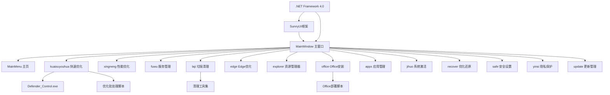

# ZyperWin++ 技术栈与依赖关系文档

## 核心技术栈

### 开发平台
- **开发语言**: C# (.NET Framework 4.0)
- **UI框架**: Windows Forms + SunnyUI
- **IDE**: Visual Studio (推荐 2019+)
- **目标平台**: Windows 7/8/10/11 (x86/x64)

### 核心框架

#### .NET Framework 4.0
- **版本要求**: 4.0 或更高版本
- **特性**:
  - Win7 需要单独集成
  - Win8+ 系统内置
  - 提供基础类库支持
  - Task 并行编程支持

#### SunnyUI Framework
- **功能**: 第三方 UI 组件库
- **主要组件**:
  - UIForm - 美化窗体基类
  - UIComboBox - 增强下拉框
  - UIProcessBar - 进度条
  - UITreeView - 树形控件
  - UISwitch - 开关控件

#### Windows Forms
- **核心控件**:
  - Form - 主窗口容器
  - UserControl - 功能模块基类
  - Panel - 内容容器
  - TreeView - 导航菜单

## 系统依赖分析

### 系统级依赖

#### Windows API 调用
```csharp
// User32 DLL
[DllImport("user32.dll")]
private static extern IntPtr GetDesktopWindow();

// 注册表操作
Microsoft.Win32.Registry
```

#### 进程管理
```csharp
// 后台进程执行
System.Diagnostics.Process
ProcessStartInfo
```

#### 文件系统操作
```csharp
// 文件和目录管理
System.IO
- Path
- File
- Directory
```

### 外部工具依赖

#### 核心工具
1. **Defender_Control.exe**
   - 位置: `.\Bin\Defender_Control.exe`
   - 功能: Windows Defender 启停控制
   - 权限要求: 管理员权限

2. **Office 部署工具**
   - 类型: 批处理脚本
   - 功能: 自动化 Office 安装
   - 网络: 需要互联网连接

#### 批处理脚本
- **基本优化脚本**: `basic_optimize.bat`
- **深度优化脚本**: `deep_optimize.bat`
- **极限优化脚本**: `extreme_optimize.bat`
- **还原脚本**: `restore_optimize.bat`

## 模块依赖关系图



## NuGet 包依赖

### 主要依赖包
```
SunnyUI (版本需确认)
- UI组件库
- 主题支持
- 动画效果
```

### 系统引用
```xml
<!-- 标准系统引用 -->
<Reference Include="System" />
<Reference Include="System.Core" />
<Reference Include="System.Drawing" />
<Reference Include="System.Windows.Forms" />
<Reference Include="Microsoft.Win32.Registry" />
```

## 性能优化技术

### 异步编程模式
```csharp
// Task 异步执行
Task.Run(() => ExecuteOptimization())

// async/await 模式
private async void uiButton1_Click(object sender, EventArgs e)
{
    uiButton1.Enabled = false;
    await Task.Delay(100);
    // 执行操作
}
```

### 内存管理
- 使用 `using` 语句管理资源
- 及时释放 Process 对象
- 避免内存泄漏

### UI 响应性
- 后台线程执行耗时操作
- 进度条显示执行状态
- 异步更新 UI 控件

## 安全机制

### 权限管理
- **管理员权限**: 大部分功能需要
- **UAC处理**: Windows Vista+ 系统提升
- **权限检查**: 运行时权限验证

### 异常处理策略
```csharp
try
{
    // 执行操作
}
catch (UnauthorizedAccessException ex)
{
    // 权限不足处理
}
catch (Exception ex)
{
    // 通用异常处理
    MessageBox.Show($"操作失败: {ex.Message}");
}
```

### 操作安全
- 操作确认机制
- 备份重要设置
- 提供回退功能

## 配置管理

### 应用程序配置
```xml
<!-- App.config 或 Settings.settings -->
<configuration>
  <appSettings>
    <add key="DefenderToolPath" value=".\\Bin\\Defender_Control.exe" />
    <add key="LogLevel" value="Info" />
  </appSettings>
</configuration>
```

### 运行时设置
- 主题配置
- 语言设置
- 日志级别

## 部署要求

### 系统要求
- **操作系统**: Windows 7 SP1 或更高版本
- **运行时**: .NET Framework 4.0+
- **内存**: 最低 512MB RAM
- **存储**: 100MB 可用空间
- **权限**: 管理员权限（推荐）

### 安装部署
1. **XCOPY 部署**: 直接复制可执行文件
2. **依赖检查**: 确保 .NET Framework 已安装
3. **权限设置**: 建议以管理员身份运行
4. **工具完整性**: 验证 Bin 目录下的工具文件

### 兼容性矩阵
| 操作系统 | .NET版本 | 权限要求 | 备注 |
|---------|---------|---------|------|
| Windows 7 | 4.0+ | 管理员 | 需要集成.NET |
| Windows 8 | 4.0+ | 管理员 | 系统内置 |
| Windows 10 | 4.0+ | 管理员 | 系统内置 |
| Windows 11 | 4.0+ | 管理员 | 系统内置 |

## 扩展开发指南

### 添加新模块
1. 创建 UserControl 派生类
2. 设计 UI 界面
3. 实现功能逻辑
4. 在 MainWindow 中注册
5. 添加导航节点

### 使用现有工具
- 参考 Defender_Control 集成方式
- 使用批处理脚本处理系统操作
- 遵循异常处理模式

### 性能优化建议
- 避免阻塞 UI 线程
- 合理使用缓存
- 及时释放资源
- 优化注册表操作